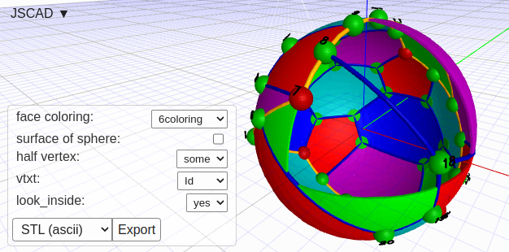
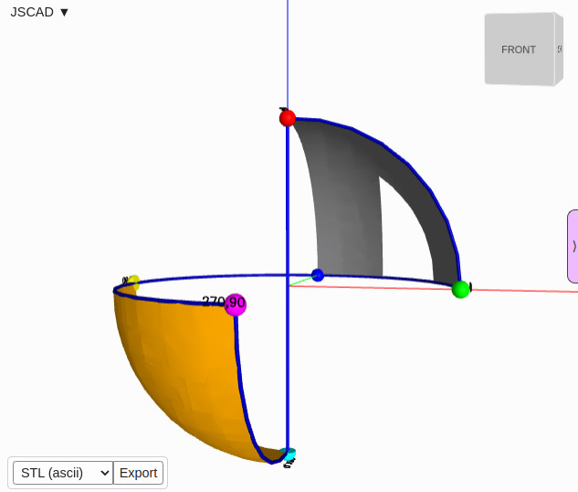
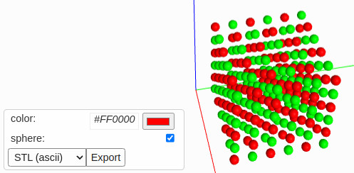
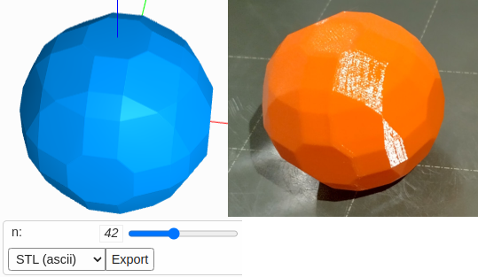
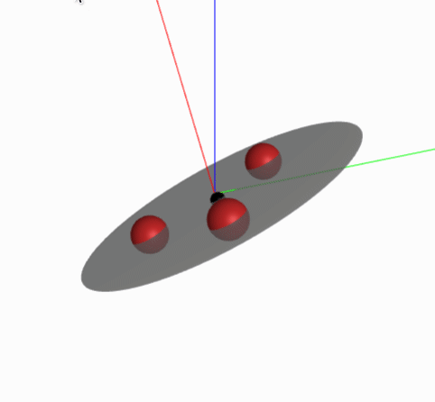

# README.md update WORK_IN_PROGRESS  

# GP3D

This repo provides 3D graphics for PARI/GP, by generating JSCAD output for view+navigate in browser.  


The functions for displaying graph vertices, edges (direct as well as great circle for sqhere embedding), faces, labels, ... are ported from [https://github.com/Hermann-SW/planar_graph_playground](https://github.com/Hermann-SW/planar_graph_playground) repo nodejs implementation.  

New [sphere_embedding.gp](sphere_embedding.gp) draws a graph onto sphere (as of now faces only, vertices+edges next).  
Currently only one demo graph is provided.   

[tools/view_b64](tools/view_b64) views JSCAD file via "data:" URL in browser on https://jscad.app.

Since 1/18/24 "data:" scheme allows to process gzipped base64 encoded URLs as well:  
https://github.com/hrgdavor/jscadui/pull/80  
Currently on a different server only with [tools/view_gzb64](tools/view_gzb64).

```
pi@raspberrypi5:~/GP3D $ name=graphs/C36.10.a gp -q < sphere_embedding.gp 
pi@raspberrypi5:~/GP3D $ tools/view_gzb64 gp.jscad
Opening in existing browser session.
pi@raspberrypi5:~/GP3D $ 
```

During development, just open https://jscad.app, generate gp.jscad outtput and drag+drop onto jscad.app.  
Whenever file gp.jscad gets written (by "wlog()" calls), jscad.app refreshes view automatically.  
You can try yourself online with this 28106 bytes base64 encoded [data URL](https://jscad.app/#data:text/plain;base64,Y29uc3QganNjYWQgPSByZXF1aXJlKCdAanNjYWQvbW9kZWxpbmcnKQpjb25zdCB7IGNvbG9yaXplIH0gPSBqc2NhZC5jb2xvcnMKY29uc3QgeyBjdWJvaWQsIGN1YmUsIHNwaGVyZSwgY3lsaW5kZXIsIGNpcmNsZSwgcG9seWdvbiB9ID0ganNjYWQucHJpbWl0aXZlcwpjb25zdCB7IHJvdGF0ZSwgdHJhbnNsYXRlIH0gPSBqc2NhZC50cmFuc2Zvcm1zCmNvbnN0IHsgZGVnVG9SYWQgfSA9IGpzY2FkLnV0aWxzCmNvbnN0IHsgYWRkLCBub3JtYWxpemUsIGxlbmd0aCwgc2NhbGUsIGRvdCB9ID0ganNjYWQubWF0aHMudmVjMwpjb25zdCB7IGV4dHJ1ZGVSb3RhdGUsIGV4dHJ1ZGVMaW5lYXIgfSA9IHJlcXVpcmUoJ0Bqc2NhZC9tb2RlbGluZycpLmV4dHJ1c2lvbnMKY29uc3QgeyBpbnRlcnNlY3QsIHN1YnRyYWN0LCB1bmlvbiB9ID0gcmVxdWlyZSgnQGpzY2FkL21vZGVsaW5nJykuYm9vbGVhbnMKY29uc3QgeyBodWxsLCBodWxsQ2hhaW4gfSA9IHJlcXVpcmUoJ0Bqc2NhZC9tb2RlbGluZycpLmh1bGxzCmNvbnN0IHsgdmVjdG9yVGV4dCB9ID0gcmVxdWlyZSgnQGpzY2FkL21vZGVsaW5nJykudGV4dApmdW5jdGlvbiBnZXRQYXJhbWV0ZXJEZWZpbml0aW9ucygpIHsKICByZXR1cm4gWwogICAgIHsgbmFtZTogJ2ZhY2VzJywgdHlwZTogJ2Nob2ljZScsIHZhbHVlczogWydQZW50YWdvbnMnLCAnNmNvbG9yaW5nJywgJ05vbmUnXSwgaW5pdGlhbDogJ1BlbnRhZ29ucycsIGNhcHRpb246ICdmYWNlIGNvbG9yaW5nOicgfSwKICAgICx7IG5hbWU6ICd3aGl0ZScsIHR5cGU6ICdjaGVja2JveCcsIGNoZWNrZWQ6IHRydWUsIGluaXRpYWw6ICcyMCcsIGNhcHRpb246ICdzdXJmYWNlIG9mIHNwaGVyZTonIH0sCiAgICAseyBuYW1lOiAnaGFsZicsIHR5cGU6ICdjaGVja2JveCcsIGNoZWNrZWQ6IHRydWUsIGluaXRpYWw6ICcyMCcsIGNhcHRpb246ICdoYWxmIHZlcnRleDonIH0sCiAgICAseyBuYW1lOiAnbG9va19pbnNpZGUnLCB0eXBlOiAnY2hvaWNlJywgdmFsdWVzOiBbJ25vJywgJ3llcyddLCBpbml0aWFsOiAnbm8nLCBjYXB0aW9uOiAnbG9va19pbnNpZGU6JyB9CiAgXTsKfQpmdW5jdGlvbiBtYXBfM0QoYywgc2MpIHsKICByZXR1cm4gW01hdGguY29zKGRlZ1RvUmFkKGNbMF0pKSpNYXRoLnNpbihkZWdUb1JhZChjWzFdKSkqc2MsIE1hdGguc2luKGRlZ1RvUmFkKGNbMF0pKSpNYXRoLnNpbihkZWdUb1JhZChjWzFdKSkqc2MsIE1hdGguY29zKGRlZ1RvUmFkKGNbMV0pKSpzY10KfQplcHMgPSAwLjAwMDAxMDAwMDAwMDAwMDAwMDAwMDAwMDAwMDAwMDAwMDAwMDAwMDAwMApzYyA9IDYuMDAwMDAwMDAwMDAwMDAwMDAwMDAwMDAwMDAwMDAwMDAwMDAwMApjb29yZHMgPSBbWzEwNS45NDU3ODM2NTU0OTU3NzAwMDAwMDAwMDAwMDAwMDAwMDAwMCwgODkuMDE0NzMzNzkyNDMyMDAwMDAwMDAwMDAwMDAwMDAwMDAwMDAwXSwgWzEyOS4wNTUwMDE5MjgxNTg0MDAwMDAwMDAwMDAwMDAwMDAwMDAwMCwgMTA3LjczNjQwNjUxMTIxMzE5MDAwMDAwMDAwMDAwMDAwMDAwMDAwXSwgWzEyMi4zMDk3MjM5MjQyMzk5MzAwMDAwMDAwMDAwMDAwMDAwMDAwMCwgMTI3LjcxMjMyMzU1NzI0MjY3MDAwMDAwMDAwMDAwMDAwMDAwMDAwXSwgWzE4MCwgMTQ3LjE1ODYzMzgwOTY1Mjc3MDAwMDAwMDAwMDAwMDAwMDAwMDAwXSwgWzE4MCwgMTY5LjA1Mjg3NzkzNjU1MDkwMDAwMDAwMDAwMDAwMDAwMDAwMDAwXSwgWzIyNSwgOTBdLCBbMjQ1LjEwMzkwOTM2MTAxNzEwMDAwMDAwMDAwMDAwMDAwMDAwMDAwLCA3MS4wMzA5MzYyODY0MDcyNDAwMDAwMDAwMDAwMDAwMDAwMDAwMDBdLCBbMjcwLCA1NC43MzU2MTAzMTcyNDUzNDYwMDAwMDAwMDAwMDAwMDAwMDAwMDBdLCBbMjcwLCAzMi44NDEzNjYxOTAzNDcyMTAwMDAwMDAwMDAwMDAwMDAwMDAwMDBdLCBbMjcwLCAxMC45NDcxMjIwNjM0NDkwNjgwMDAwMDAwMDAwMDAwMDAwMDAwMDBdLCBbOTAsIDEwLjk0NzEyMjA2MzQ0OTA2ODAwMDAwMDAwMDAwMDAwMDAwMDAwMF0sIFs5MCwgMzIuODQxMzY2MTkwMzQ3MjEwMDAwMDAwMDAwMDAwMDAwMDAwMDAwXSwgWzkwLCA1NC43MzU2MTAzMTcyNDUzNDYwMDAwMDAwMDAwMDAwMDAwMDAwMDBdLCBbMTEzLjE4NTE1Nzg5Nzc0NDY1MDAwMDAwMDAwMDAwMDAwMDAwMDAwLCA3MC41MzQyOTY0ODAxMjY0MTAwMDAwMDAwMDAwMDAwMDAwMDAwMDBdLCBbNzUuNTk3MTkxMTQwNTg0MzAwMDAwMDAwMDAwMDAwMDAwMDAwMDAwLCA4OC43NzM0OTgzODU5NTYzNDAwMDAwMDAwMDAwMDAwMDAwMDAwMDBdLCBbNjkuNTMzMDA0MTU2ODEyNzgwMDAwMDAwMDAwMDAwMDAwMDAwMDAwLCA2Ny40NTA5Mjc2Nzk3NDYzMzAwMDAwMDAwMDAwMDAwMDAwMDAwMDBdLCBbNTIuNzg4MDUxNTc1NzQyNDYwMDAwMDAwMDAwMDAwMDAwMDAwMDAwLCA4Mi4yODI5MTQ4Nzk5OTU1MDAwMDAwMDAwMDAwMDAwMDAwMDAwMDBdLCBbMzcuMjExOTQ4NDI0MjU3NTQwMDAwMDAwMDAwMDAwMDAwMDAwMDAwLCA5Ny43MTcwODUxMjAwMDQ1MDAwMDAwMDAwMDAwMDAwMDAwMDAwMDBdLCBbMzM0LjQxOTAyMzY1NTAwMzc0MDAwMDAwMDAwMDAwMDAwMDAwMDAwLCA3OS4wNjQwMjgyNzQwMDE3MDAwMDAwMDAwMDAwMDAwMDAwMDAwMDBdLCBbMzM2LjA0NTEyMjU0MDc1MzU0MDAwMDAwMDAwMDAwMDAwMDAwMDAwLCAxMDYuNjMzNjMzNTExNjUzMzkwMDAwMDAwMDAwMDAwMDAwMDAwMDBdLCBbMzEzLjcxNjM0Mzk2NzI1NjkwMDAwMDAwMDAwMDAwMDAwMDAwMDAwLCAxMTUuNTcyNDgyNTc4MjAzODYwMDAwMDAwMDAwMDAwMDAwMDAwMDBdLCBbMCwgMTY5LjA1Mjg3NzkzNjU1MDkwMDAwMDAwMDAwMDAwMDAwMDAwMDAwXSwgWzAsIDE0Ny4xNTg2MzM4MDk2NTI3NzAwMDAwMDAwMDAwMDAwMDAwMDAwMF0sIFs1Ny44NzQxNjk4NDQ1NjE0MjAwMDAwMDAwMDAwMDAwMDAwMDAwMDAsIDEyOC4yNDE5MzAzNTA4NjIwNTAwMDAwMDAwMDAwMDAwMDAwMDAwMF0sIFs1MS4zMTI3ODU2MDk0NDQyOTAwMDAwMDAwMDAwMDAwMDAwMDAwMDAsIDEwOS44NTQ4MzM2ODU2OTA3MDAwMDAwMDAwMDAwMDAwMDAwMDAwMF0sIFsyMC40NjY5OTU4NDMxODcyMTcwMDAwMDAwMDAwMDAwMDAwMDAwMDAsIDExMi41NDkwNzIzMjAyNTM2NDAwMDAwMDAwMDAwMDAwMDAwMDAwMF0sIFswLCAxMjUuMjY0Mzg5NjgyNzU0NjUwMDAwMDAwMDAwMDAwMDAwMDAwMDBdLCBbMjI4LjkzNDI4NjEyMjA2NDY2MDAwMDAwMDAwMDAwMDAwMDAwMDAwLCA1OS41OTIzMzY2MDU4MjI0NDAwMDAwMDAwMDAwMDAwMDAwMDAwMDBdLCBbMjE2LjMwMTU2ODU1MDQ5MTU0MDAwMDAwMDAwMDAwMDAwMDAwMDAwLCAzOS4wMzkwMzU5NDExMDc5NTQwMDAwMDAwMDAwMDAwMDAwMDAwMDBdLCBbMTQ5Ljk3MDQxOTUyOTQwOTkwMDAwMDAwMDAwMDAwMDAwMDAwMDAwLCA0Ni41Nzc2NDkxNTQwNTIzNTAwMDAwMDAwMDAwMDAwMDAwMDAwMDBdLCBbMTQzLjYwOTY5MDAzNzczODE4MDAwMDAwMDAwMDAwMDAwMDAwMDAwLCA2Ny44NTI1NDUzMzA3MDE5MDAwMDAwMDAwMDAwMDAwMDAwMDAwMDBdLCBbMTY3LjY3MzQ5MjY4NjA2MDA2MDAwMDAwMDAwMDAwMDAwMDAwMDAwLCA4Ni40NDU2OTAzNTc5MjY5NTAwMDAwMDAwMDAwMDAwMDAwMDAwMDBdLCBbMTU4LjkwOTQ5ODIwNDczOTQ2MDAwMDAwMDAwMDAwMDAwMDAwMDAwLCAxMDYuNDgyMTYyMTgzOTY0OTIwMDAwMDAwMDAwMDAwMDAwMDAwMDBdLCBbMTgwLCAxMjUuMjY0Mzg5NjgyNzU0NjUwMDAwMDAwMDAwMDAwMDAwMDAwMDBdLCBbMjA0Ljg5NjA5MDYzODk4MjkwMDAwMDAwMDAwMDAwMDAwMDAwMDAwLCAxMDguOTY5MDYzNzEzNTkyNzUwMDAwMDAwMDAwMDAwMDAwMDAwMDBdLCBbMjAwLjUwMTI4OTgxNTcwMjUzMDAwMDAwMDAwMDAwMDAwMDAwMDAwLCA4NS4wMDIzNjM1NTkxMTQwMzAwMDAwMDAwMDAwMDAwMDAwMDAwMDBdXQpmdW5jdGlvbiB2ZXJ0ZXgoX3YsIGhhbGY9ZmFsc2UpIHsKICAgIHAgPSBjb29yZHNbX3ZdIAogICAgdiA9IG1hcF8zRChwLHNjKQogICAgcyA9IHNwaGVyZSh7cmFkaXVzOiAwLjUsIGNlbnRlcjogdn0pCiAgICBpZiAoaGFsZikgewogICAgICAgIGxhMSA9IGRlZ1RvUmFkKHBbMF0pCiAgICAgICAgcGgxID0gZGVnVG9SYWQoOTAgLSBwWzFdKQogICAgICAgIHJldHVybiBjb2xvcml6ZShbMCwgMC43LCAwXSwKICAgICAgICAgICAgc3VidHJhY3QocywKICAgICAgICAgICAgICAgIHRyYW5zbGF0ZShbMCwgMCwgMF0sCiAgICAgICAgICAgICAgICAgICAgcm90YXRlKFswLCAwLCBsYTFdLAogICAgICAgICAgICAgICAgICAgICAgICByb3RhdGUoWzAsIC1waDEsIDBdLAogICAgICAgICAgICAgICAgICAgICAgICAgICAgdHJhbnNsYXRlKFtzYyswLjUsIDBdLAogICAgICAgICAgICAgICAgICAgICAgICAgICAgICAgIHJvdGF0ZShbZGVnVG9SYWQoOTApLCAwLCBkZWdUb1JhZCg5MCldLAogICAgICAgICAgICAgICAgICAgICAgICAgICAgICAgICAgICB0cmFuc2xhdGUoWy0wLCAtMCwgLTFdLAogICAgICAgICAgICAgICAgICAgICAgICAgICAgICAgICAgICAgICAgIGN1Ym9pZCh7c2l6ZTogWzEsIDEsIDAuOF19KQogICAgICAgICAgICAgICAgICAgICAgICAgICAgICAgICAgICApCiAgICAgICAgICAgICAgICAgICAgICAgICAgICAgICAgKQogICAgICAgICAgICAgICAgICAgICAgICAgICAgKQogICAgICAgICAgICAgICAgICAgICAgICApCiAgICAgICAgICAgICAgICAgICAgKQogICAgICAgICAgICAgICAgKQogICAgICAgICAgICApCiAgICAgICAgKQogICAgfSBlbHNlIHsKICAgICAgICByZXR1cm4gY29sb3JpemUoWzAsIDAuNywgMF0sIHMpCiAgICB9Cn0KZnVuY3Rpb24gdHh0KG1lc2csIHcpIHsKICAgIGNvbnN0IGxpbmVSYWRpdXMgPSB3IC8gMgogICAgY29uc3QgbGluZUNvcm5lciA9IGNpcmNsZSh7IHJhZGl1czogbGluZVJhZGl1cyB9KQoKICAgIGNvbnN0IGxpbmVTZWdtZW50UG9pbnRBcnJheXMgPSB2ZWN0b3JUZXh0KHsgeDogMCwgeTogMCwgaGVpZ2h0OiAwLjI1LCBpbnB1dDogbWVzZyB9KQoKICAgIGNvbnN0IGxpbmVTZWdtZW50cyA9IFtdCiAgICBsaW5lU2VnbWVudFBvaW50QXJyYXlzLmZvckVhY2goZnVuY3Rpb24oc2VnbWVudFBvaW50cykgewogICAgICAgIGNvbnN0IGNvcm5lcnMgPSBzZWdtZW50UG9pbnRzLm1hcCgocG9pbnQpID0+IHRyYW5zbGF0ZShwb2ludCwgbGluZUNvcm5lcikpCiAgICAgICAgbGluZVNlZ21lbnRzLnB1c2goaHVsbENoYWluKGNvcm5lcnMpKQogICAgfSkKICAgIGNvbnN0IG1lc3NhZ2UyRCA9IHVuaW9uKGxpbmVTZWdtZW50cykKICAgIHJldHVybiBleHRydWRlTGluZWFyKHsgaGVpZ2h0OiB3IH0sIG1lc3NhZ2UyRCkKfQpmdW5jdGlvbiB2dHh0KF9wMSwgbnVtKSB7CiAgICBzdHIgPSBudW0udG9TdHJpbmcoKQogICAgcDEgPSBjb29yZHNbX3AxXQogICAgbGExID0gZGVnVG9SYWQocDFbMF0pCiAgICBwaDEgPSBkZWdUb1JhZCg5MCAtIHAxWzFdKQogICAgcmV0dXJuIHRyYW5zbGF0ZShbMCwgMCwgMF0sCiAgICAgICAgcm90YXRlKFswLCAwLCBsYTFdLAogICAgICAgICAgICByb3RhdGUoWzAsIC1waDEsIDBdLAogICAgICAgICAgICAgICAgdHJhbnNsYXRlKFtzYyswLjUsIDAuMTUtMC4yNSpzdHIubGVuZ3RoXSwKICAgICAgICAgICAgICAgICAgICByb3RhdGUoW2RlZ1RvUmFkKDkwKSwgMCwgZGVnVG9SYWQoOTApXSwKICAgICAgICAgICAgICAgICAgICAgICAgY29sb3JpemUoWzAsIDAsIDBdLAogICAgICAgICAgICAgICAgICAgICAgICAgICAgdHh0KHN0ciwgMC4wNSkKICAgICAgICAgICAgICAgICAgICAgICAgKQogICAgICAgICAgICAgICAgICAgICkKICAgICAgICAgICAgICAgICkKICAgICAgICAgICAgKQogICAgICAgICkKICAgICkKfQpmdW5jdGlvbiBlZGdlKF92LCBfdywgX2UpIHsKICAgIHYgPSBtYXBfM0QoY29vcmRzW192XSwgc2MpCiAgICB3ID0gbWFwXzNEKGNvb3Jkc1tfd10sIHNjKQogICAgZCA9IFswLCAwLCAwXQogICAgeCA9IFswLCAwLCAwXQogICAganNjYWQubWF0aHMudmVjMy5zdWJ0cmFjdChkLCB3LCB2KQogICAgYWRkKHgsIHYsIHcpCiAgICBzY2FsZSh3LCB4LCAwLjUpCiAgaWYgKGxlbmd0aChkKSA+PSBlcHMpIHsKICAgIHJldHVybiBjb2xvcml6ZShbMCwgMCwgMSwgMV0sIAogICAgICAgIHRyYW5zbGF0ZSh3LCAKICAgICAgICAgICAgcm90YXRlKFswLCBNYXRoLmFjb3MoZFsyXS9sZW5ndGgoZCkpLCBNYXRoLmF0YW4yKGRbMV0sIGRbMF0pXSwKICAgICAgICAgICAgICAgIGN5bGluZGVyKHtyYWRpdXM6IDAuMSwgaGVpZ2h0OiBsZW5ndGgoZCl9KQogICAgICAgICAgICApCiAgICAgICAgKQogICAgKQogIH0gZWxzZSB7CiAgICByZXR1cm4gY3ViZSh7c2l6ZTogMC4wMX0pCiAgfQp9CmZ1bmN0aW9uIGVkZ2UyKF9wMSwgX3AyLCBfZSkgewogICAgcDEgPSBjb29yZHNbX3AxXQogICAgcDIgPSBjb29yZHNbX3AyXQogICAgLy8gYWwvbGEvcGg6IGFscGhhL2xhbWJkYS9waGkgfCBseHkvc3h5OiBkZWx0YSBsYW1iZGFfeHkvc2lnbWFfeHkKICAgIC8vIGh0dHBzOi8vZW4ud2lraXBlZGlhLm9yZy93aWtpL0dyZWF0LWNpcmNsZV9uYXZpZ2F0aW9uI0NvdXJzZQogICAgbGExID0gZGVnVG9SYWQocDFbMF0pCiAgICBsYTIgPSBkZWdUb1JhZChwMlswXSkKICAgIGwxMiA9IGxhMiAtIGxhMQogICAgcGgxID0gZGVnVG9SYWQoOTAgLSBwMVsxXSkKICAgIHBoMiA9IGRlZ1RvUmFkKDkwIC0gcDJbMV0pCiAgICBhbDEgPSBNYXRoLmF0YW4yKE1hdGguY29zKHBoMikqTWF0aC5zaW4obDEyKSwgTWF0aC5jb3MocGgxKSpNYXRoLnNpbihwaDIpLU1hdGguc2luKHBoMSkqTWF0aC5jb3MocGgyKSpNYXRoLmNvcyhsMTIpKQogICAgLy8gZGVsdGEgc2lnbWFfMTIKICAgIC8vIGh0dHBzOi8vZW4ud2lraXBlZGlhLm9yZy93aWtpL0dyZWF0LWNpcmNsZV9kaXN0YW5jZSNGb3JtdWxhZQogICAgczEyID0gTWF0aC5hY29zKE1hdGguc2luKHBoMSkqTWF0aC5zaW4ocGgyKStNYXRoLmNvcyhwaDEpKk1hdGguY29zKHBoMikqTWF0aC5jb3MobDEyKSkKICAgIHJldHVybiByb3RhdGUoWzAsIDAsIGxhMV0sCiAgICAgICAgcm90YXRlKFswLCAtcGgxLCAwXSwKICAgICAgICAgICAgcm90YXRlKFtkZWdUb1JhZCg5MCktYWwxLCAwLCAwXSwKICAgICAgICAgICAgICAgIGNvbG9yaXplKFswLCAwLCAwLjddLAogICAgICAgICAgICAgICAgICAgIGV4dHJ1ZGVSb3RhdGUoe3NlZ21lbnRzOiAzMiwgYW5nbGU6IHMxMn0sCiAgICAgICAgICAgICAgICAgICAgICAgIGNpcmNsZSh7cmFkaXVzOiAwLjEsIGNlbnRlcjogW3NjLDBdfSkKICAgICAgICAgICAgICAgICAgICApCiAgICAgICAgICAgICAgICApCiAgICAgICAgICAgICkKICAgICAgICApCiAgICApCn0KZnVuY3Rpb24gc3BfdHJpYTIociwgdGFuZywgcGFuZywgdGhpLCBwb2ludHMsIHNlZ21lbnRzKSB7CiAgICBjb25zdCBjb29yZHMgPSBbXQogICAgcHRzMiA9IE1hdGgudHJ1bmMocG9pbnRzIC8gMikKICAgIAogICAgZm9yKGkgPSAwOyBpPHB0czI7IGk9aSsxKSB7CiAgICAgICAgdGggPSBpKih0YW5nLyhwdHMyLTEpKQogICAgICAgIGNvb3Jkcy5wdXNoKFsoci10aGkvMikqTWF0aC5zaW4odGgpLCAoci10aGkvMikqTWF0aC5jb3ModGgpXSkKICAgIH0KICAgIGZvcihpID0gcHRzMi0xOyBpPj0wOyBpPWktMSkgewogICAgICAgIHRoID0gaSoodGFuZy8ocHRzMi0xKSkKICAgICAgICBjb29yZHMucHVzaChbKHIrdGhpLzIpKk1hdGguc2luKHRoKSwgKHIrdGhpLzIpKk1hdGguY29zKHRoKV0pCiAgICB9CiAgICByZXR1cm4gZXh0cnVkZVJvdGF0ZSh7c2VnbWVudHM6IHNlZ21lbnRzLCBhbmdsZTogcGFuZ30sIAogICAgICAgIHBvbHlnb24oe3BvaW50czogY29vcmRzfSkKICAgICkKfQpmdW5jdGlvbiBzcF90cmlhKF9wMSwgX3AyLCBfcDMsIHN1YikgewogICAgcDEgPSBjb29yZHNbX3AxXQogICAgcDIgPSBjb29yZHNbX3AyXQogICAgcDMgPSBjb29yZHNbX3AzXQogICAgLy8gYWwvbGEvcGg6IGFscGhhL2xhbWJkYS9waGkgfCBseHkvc3h5OiBkZWx0YSBsYW1iZGFfeHkvc2lnbWFfeHkKICAgIC8vIGh0dHBzOi8vZW4ud2lraXBlZGlhLm9yZy93aWtpL0dyZWF0LWNpcmNsZV9uYXZpZ2F0aW9uI0NvdXJzZQogICAgbGExID0gZGVnVG9SYWQocDFbMF0pCiAgICBsYTIgPSBkZWdUb1JhZChwMlswXSkKICAgIGxhMyA9IGRlZ1RvUmFkKHAzWzBdKQogICAgbDEyID0gbGEyIC0gbGExCiAgICBsMTMgPSBsYTMgLSBsYTEKICAgIGwzMiA9IGxhMiAtIGxhMwogICAgbDIzID0gbGEzIC0gbGEyCiAgICBsMzEgPSBsYTEgLSBsYTMKICAgIHBoMSA9IGRlZ1RvUmFkKDkwIC0gcDFbMV0pCiAgICBwaDIgPSBkZWdUb1JhZCg5MCAtIHAyWzFdKQogICAgcGgzID0gZGVnVG9SYWQoOTAgLSBwM1sxXSkKICAgIGFsMTIgPSBNYXRoLmF0YW4yKE1hdGguY29zKHBoMikqTWF0aC5zaW4obDEyKSwgTWF0aC5jb3MocGgxKSpNYXRoLnNpbihwaDIpLU1hdGguc2luKHBoMSkqTWF0aC5jb3MocGgyKSpNYXRoLmNvcyhsMTIpKQogICAgYWwxMyA9IE1hdGguYXRhbjIoTWF0aC5jb3MocGgzKSpNYXRoLnNpbihsMTMpLCBNYXRoLmNvcyhwaDEpKk1hdGguc2luKHBoMyktTWF0aC5zaW4ocGgxKSpNYXRoLmNvcyhwaDMpKk1hdGguY29zKGwxMykpCiAgICBhbDMxID0gTWF0aC5hdGFuMihNYXRoLmNvcyhwaDEpKk1hdGguc2luKGwzMSksIE1hdGguY29zKHBoMykqTWF0aC5zaW4ocGgxKS1NYXRoLnNpbihwaDMpKk1hdGguY29zKHBoMSkqTWF0aC5jb3MobDMxKSkKICAgIGFsMzIgPSBNYXRoLmF0YW4yKE1hdGguY29zKHBoMikqTWF0aC5zaW4obDMyKSwgTWF0aC5jb3MocGgzKSpNYXRoLnNpbihwaDIpLU1hdGguc2luKHBoMykqTWF0aC5jb3MocGgyKSpNYXRoLmNvcyhsMzIpKQogICAgLy8gZGVsdGEgc2lnbWFfeHkKICAgIC8vIGh0dHBzOi8vZW4ud2lraXBlZGlhLm9yZy93aWtpL0dyZWF0LWNpcmNsZV9kaXN0YW5jZSNGb3JtdWxhZQogICAgczEyID0gTWF0aC5hY29zKE1hdGguc2luKHBoMSkqTWF0aC5zaW4ocGgyKStNYXRoLmNvcyhwaDEpKk1hdGguY29zKHBoMikqTWF0aC5jb3MobDEyKSkKICAgIHMyMyA9IE1hdGguYWNvcyhNYXRoLnNpbihwaDIpKk1hdGguc2luKHBoMykrTWF0aC5jb3MocGgyKSpNYXRoLmNvcyhwaDMpKk1hdGguY29zKGwyMykpCiAgICBzMTMgPSBNYXRoLmFjb3MoTWF0aC5zaW4ocGgxKSpNYXRoLnNpbihwaDMpK01hdGguY29zKHBoMSkqTWF0aC5jb3MocGgzKSpNYXRoLmNvcyhsMTMpKQoKICAgIGlmIChzMTMgPCBzMTIpIHsKICAgICAgICBpZiAoczEyID49IHMyMykgewogICAgICAgICAgICByZXR1cm4gc3BfdHJpYShfcDEsIF9wMywgX3AyLCBzdWIpCiAgICAgICAgfSBlbHNlIHsKICAgICAgICAgICAgcmV0dXJuIHNwX3RyaWEoX3AyLCBfcDEsIF9wMywgc3ViKQogICAgICAgIH0KICAgIH0gZWxzZSB7CiAgICAgICAgaWYgKHMxMyA8IHMyMykgewogICAgICAgICAgICByZXR1cm4gc3BfdHJpYShfcDIsIF9wMSwgX3AzLCBzdWIpCiAgICAgICAgfSBlbHNlIGlmIChNYXRoLmFicyhzMTMtczEyLXMyMykgPj0gZXBzKSB7CiAgICAgICAgICAgIGZ1bmN0aW9uIG1waShhbmcpIHsgcmV0dXJuIChhbmcgPCAtTWF0aC5QSSkgPyAyKk1hdGguUEkgKyBhbmcgOiAoKGFuZyA+IE1hdGguUEkpID8gYW5nIC0gMipNYXRoLlBJIDogYW5nKSB9CgogICAgICAgICAgICB2MSA9IG1hcF8zRChwMSwgMSkKICAgICAgICAgICAgdjIgPSBtYXBfM0QocDIsIDEpCiAgICAgICAgICAgIHYzID0gbWFwXzNEKHAzLCAxKQogICAgICAgICAgICBtcyA9IFswLCAwLCAwXQogICAgICAgICAgICBtczIgPSBbMCwgMCwgMF0KICAgICAgICAgICAgc3YxPVswLCAwLCAwXQogICAgICAgICAgICBzdjI9WzAsIDAsIDBdCiAgICAgICAgICAgIHN2Mz1bMCwgMCwgMF0KICAgICAgICAgICAgczE9WzAsIDAsIDBdCiAgICAgICAgICAgIHMyPVswLCAwLCAwXQogICAgICAgICAgICBzMz1bMCwgMCwgMF0KICAgICAgICAgICAgYWRkKG1zLCB2MSwgdjIpCiAgICAgICAgICAgIGFkZChtcywgbXMsIHYzKQogICAgICAgICAgICBub3JtYWxpemUobXMyLCBtcykKICAgICAgICAgICAgbWkgPSBNYXRoLm1pbihkb3QodjEsIG1zMiksIGRvdCh2MiwgbXMyKSwgZG90KHYzLCBtczIpKQoKICAgICAgICAgICAgc2NhbGUoc3YxLCB2MSwgc2MpCiAgICAgICAgICAgIHNjYWxlKHN2MiwgdjIsIHNjKQogICAgICAgICAgICBzY2FsZShzdjMsIHYzLCBzYykKICAgICAgICAgICAgc2NhbGUoczEsIHN2MSwgMS9taSkKICAgICAgICAgICAgc2NhbGUoczIsIHN2MiwgMS9taSkKICAgICAgICAgICAgc2NhbGUoczMsIHN2MywgMS9taSkKCiAgICAgICAgICAgIHJldHVybiBjb2xvcml6ZShbMC41LCAwLjUsIDAuNV0sCiAgICAgICAgICAgICAgICBzdWJ0cmFjdCgKICAgICAgICAgICAgICAgICAgICBpbnRlcnNlY3QoCiAgICAgICAgICAgICAgICAgICAgICAgIHVuaW9uKAogICAgICAgICAgICAgICAgICAgICAgICAgICAgdHJhbnNsYXRlKFswLCAwLCAwXSwKICAgICAgICAgICAgICAgICAgICAgICAgICAgICAgICByb3RhdGUoWzAsIDAsIGxhMS1kZWdUb1JhZCgxODApXSwKICAgICAgICAgICAgICAgICAgICAgICAgICAgICAgICAgICAgcm90YXRlKFswLCBwaDEtZGVnVG9SYWQoOTApLCAwXSwKICAgICAgICAgICAgICAgICAgICAgICAgICAgICAgICAgICAgICAgIHJvdGF0ZShbMCwwLC1hbDEzXSwKICAgICAgICAgICAgICAgICAgICAgICAgICAgICAgICAgICAgICAgICAgICBzcF90cmlhMihzYywgczEyLCBtcGkoYWwxMy1hbDEyKSwgMC4xLCAyNCwgMzApCiAgICAgICAgICAgICAgICAgICAgICAgICAgICAgICAgICAgICAgICApCiAgICAgICAgICAgICAgICAgICAgICAgICAgICAgICAgICAgICkKICAgICAgICAgICAgICAgICAgICAgICAgICAgICAgICApCiAgICAgICAgICAgICAgICAgICAgICAgICAgICApLAogICAgICAgICAgICAgICAgICAgICAgICAgICAgdHJhbnNsYXRlKFswLCAwLCAwXSwKICAgICAgICAgICAgICAgICAgICAgICAgICAgICAgICByb3RhdGUoWzAsIDAsIGxhMy1kZWdUb1JhZCgxODApXSwKICAgICAgICAgICAgICAgICAgICAgICAgICAgICAgICAgICAgcm90YXRlKFswLCBwaDMtZGVnVG9SYWQoOTApLCAwXSwKICAgICAgICAgICAgICAgICAgICAgICAgICAgICAgICAgICAgICAgIHJvdGF0ZShbMCwgMCwgLWFsMzFdLAogICAgICAgICAgICAgICAgICAgICAgICAgICAgICAgICAgICAgICAgICAgIHNwX3RyaWEyKHNjLCBzMjMsIG1waShhbDMxLWFsMzIpLCAwLjEsIDI0LCAzMCkKICAgICAgICAgICAgICAgICAgICAgICAgICAgICAgICAgICAgICAgICkKICAgICAgICAgICAgICAgICAgICAgICAgICAgICAgICAgICAgKQogICAgICAgICAgICAgICAgICAgICAgICAgICAgICAgICkKICAgICAgICAgICAgICAgICAgICAgICAgICAgICkKICAgICAgICAgICAgICAgICAgICAgICAgKSwKICAgICAgICAgICAgICAgICAgICAgICAgaHVsbCgKICAgICAgICAgICAgICAgICAgICAgICAgICAgIGN1YmUoe2NlbnRlcjogc3YxLCBzaXplOiAwLjAxfSkKICAgICAgICAgICAgICAgICAgICAgICAgICAgICxjdWJlKHtjZW50ZXI6IHN2Miwgc2l6ZTogMC4wMX0pCiAgICAgICAgICAgICAgICAgICAgICAgICAgICAsY3ViZSh7Y2VudGVyOiBzdjMsIHNpemU6IDAuMDF9KQogICAgICAgICAgICAgICAgICAgICAgICAgICAgLGN1YmUoe2NlbnRlcjogczEsIHNpemU6IDAuMDF9KQogICAgICAgICAgICAgICAgICAgICAgICAgICAgLGN1YmUoe2NlbnRlcjogczIsIHNpemU6IDAuMDF9KQogICAgICAgICAgICAgICAgICAgICAgICAgICAgLGN1YmUoe2NlbnRlcjogczMsIHNpemU6IDAuMDF9KQogICAgICAgICAgICAgICAgICAgICAgICApCiAgICAgICAgICAgICAgICAgICApCiAgICAgICAgICAgICAgICAgICAsc3ViKQogICAgICAgICAgICAgICAgKQogICAgICAgIH0gZWxzZSB7CiAgICAgICAgICAgIHJldHVybiBjdWJlKHtzaXplOiAwLjAxfSkKICAgICAgICB9CiAgICB9Cn0KZnVuY3Rpb24gbWFpbihwYXJhbXMpIHsKICAgIHN1YiA9IFtjdWJlKHtzaXplOiAocGFyYW1zLmxvb2tfaW5zaWRlID09PSAneWVzJyk/c2MrMC4xOjAuMDEsIGNlbnRlcjogW3NjLzIsLXNjLzIsc2MvMl19KV0KcGVudGFnb25zID0gKHBhcmFtcy5mYWNlcyAhPT0gJ1BlbnRhZ29ucycpID8gW10gOiBbW10KLHNwX3RyaWEoIDEzICwgMCAsIDE0ICwgc3ViKQosc3BfdHJpYSggMTMgLCAxNCAsIDE1ICwgc3ViKQosc3BfdHJpYSggMTMgLCAxNSAsIDEyICwgc3ViKQosc3BfdHJpYSggMiAsIDEgLCAzMiAsIHN1YikKLHNwX3RyaWEoIDIgLCAzMiAsIDMzICwgc3ViKQosc3BfdHJpYSggMiAsIDMzICwgMyAsIHN1YikKLHNwX3RyaWEoIDQgLCAzICwgMzMgLCBzdWIpCixzcF90cmlhKCA0ICwgMzMgLCAzNCAsIHN1YikKLHNwX3RyaWEoIDQgLCAzNCAsIDUgLCBzdWIpCixzcF90cmlhKCAyMSAsIDQgLCA1ICwgc3ViKQosc3BfdHJpYSggMjEgLCA1ICwgNiAsIHN1YikKLHNwX3RyaWEoIDIxICwgNiAsIDIwICwgc3ViKQosc3BfdHJpYSggOCAsIDcgLCAyNyAsIHN1YikKLHNwX3RyaWEoIDggLCAyNyAsIDI4ICwgc3ViKQosc3BfdHJpYSggOCAsIDI4ICwgOSAsIHN1YikKLHNwX3RyaWEoIDEwICwgOSAsIDI4ICwgc3ViKQosc3BfdHJpYSggMTAgLCAyOCAsIDI5ICwgc3ViKQosc3BfdHJpYSggMTAgLCAyOSAsIDExICwgc3ViKQosc3BfdHJpYSggMTYgLCAxMCAsIDExICwgc3ViKQosc3BfdHJpYSggMTYgLCAxMSAsIDEyICwgc3ViKQosc3BfdHJpYSggMTYgLCAxMiAsIDE1ICwgc3ViKQosc3BfdHJpYSggMTIgLCAxMSAsIDI5ICwgc3ViKQosc3BfdHJpYSggMTIgLCAyOSAsIDMwICwgc3ViKQosc3BfdHJpYSggMTIgLCAzMCAsIDEzICwgc3ViKQosc3BfdHJpYSggMTggLCAxNyAsIDI1ICwgc3ViKQosc3BfdHJpYSggMTggLCAyNSAsIDI2ICwgc3ViKQosc3BfdHJpYSggMTggLCAyNiAsIDE5ICwgc3ViKQosc3BfdHJpYSggMjAgLCAxOSAsIDI2ICwgc3ViKQosc3BfdHJpYSggMjAgLCAyNiAsIDIyICwgc3ViKQosc3BfdHJpYSggMjAgLCAyMiAsIDIxICwgc3ViKQosc3BfdHJpYSggMjMgLCAyMiAsIDI2ICwgc3ViKQosc3BfdHJpYSggMjMgLCAyNiAsIDI1ICwgc3ViKQosc3BfdHJpYSggMjMgLCAyNSAsIDI0ICwgc3ViKQosc3BfdHJpYSggMzIgLCAzMSAsIDM1ICwgc3ViKQosc3BfdHJpYSggMzIgLCAzNSAsIDM0ICwgc3ViKQosc3BfdHJpYSggMzIgLCAzNCAsIDMzICwgc3ViKQpdCnNpeGNvbCA9IChwYXJhbXMuZmFjZXMgIT09ICc2Y29sb3JpbmcnKSA/IFtdIDogW1tdCiwgY29sb3JpemUoIFswLCAwLjcwMDAwMDAwMDAwMDAwMDAwMDAwMDAwMDAwMDAwMDAwMDAwMDAwLCAwLjcwMDAwMDAwMDAwMDAwMDAwMDAwMDAwMDAwMDAwMDAwMDAwMDAwXSAsIHNwX3RyaWEoIDAgLCAzMiAsIDEgLCBzdWIpKQosIGNvbG9yaXplKCBbMCwgMC43MDAwMDAwMDAwMDAwMDAwMDAwMDAwMDAwMDAwMDAwMDAwMDAwMCwgMC43MDAwMDAwMDAwMDAwMDAwMDAwMDAwMDAwMDAwMDAwMDAwMDAwMF0gLCBzcF90cmlhKCAwICwgMzEgLCAzMiAsIHN1YikpCiwgY29sb3JpemUoIFswLCAwLjcwMDAwMDAwMDAwMDAwMDAwMDAwMDAwMDAwMDAwMDAwMDAwMDAwLCAwLjcwMDAwMDAwMDAwMDAwMDAwMDAwMDAwMDAwMDAwMDAwMDAwMDAwXSAsIHNwX3RyaWEoIDAgLCAzMCAsIDMxICwgc3ViKSkKLCBjb2xvcml6ZSggWzAsIDAuNzAwMDAwMDAwMDAwMDAwMDAwMDAwMDAwMDAwMDAwMDAwMDAwMDAsIDAuNzAwMDAwMDAwMDAwMDAwMDAwMDAwMDAwMDAwMDAwMDAwMDAwMDBdICwgc3BfdHJpYSggMCAsIDEzICwgMzAgLCBzdWIpKQosIGNvbG9yaXplKCBbMC45MDAwMDAwMDAwMDAwMDAwMDAwMDAwMDAwMDAwMDAwMDAwMDAwMCwgMC5FLTM4LCAwXSAsIHNwX3RyaWEoIDEzICwgMTUgLCAxMiAsIHN1YikpCiwgY29sb3JpemUoIFswLjkwMDAwMDAwMDAwMDAwMDAwMDAwMDAwMDAwMDAwMDAwMDAwMDAwLCAwLkUtMzgsIDBdICwgc3BfdHJpYSggMTMgLCAxNCAsIDE1ICwgc3ViKSkKLCBjb2xvcml6ZSggWzAuOTAwMDAwMDAwMDAwMDAwMDAwMDAwMDAwMDAwMDAwMDAwMDAwMDAsIDAuRS0zOCwgMF0gLCBzcF90cmlhKCAxMyAsIDAgLCAxNCAsIHN1YikpCiwgY29sb3JpemUoIFswLCAwLCAwLjkwMDAwMDAwMDAwMDAwMDAwMDAwMDAwMDAwMDAwMDAwMDAwMDAwXSAsIHNwX3RyaWEoIDE0ICwgMjMgLCAyNCAsIHN1YikpCiwgY29sb3JpemUoIFswLCAwLCAwLjkwMDAwMDAwMDAwMDAwMDAwMDAwMDAwMDAwMDAwMDAwMDAwMDAwXSAsIHNwX3RyaWEoIDE0ICwgMiAsIDIzICwgc3ViKSkKLCBjb2xvcml6ZSggWzAsIDAsIDAuOTAwMDAwMDAwMDAwMDAwMDAwMDAwMDAwMDAwMDAwMDAwMDAwMDBdICwgc3BfdHJpYSggMTQgLCAxICwgMiAsIHN1YikpCiwgY29sb3JpemUoIFswLCAwLCAwLjkwMDAwMDAwMDAwMDAwMDAwMDAwMDAwMDAwMDAwMDAwMDAwMDAwXSAsIHNwX3RyaWEoIDE0ICwgMCAsIDEgLCBzdWIpKQosIGNvbG9yaXplKCBbMC45MDAwMDAwMDAwMDAwMDAwMDAwMDAwMDAwMDAwMDAwMDAwMDAwMCwgMC5FLTM4LCAwXSAsIHNwX3RyaWEoIDIgLCAzMyAsIDMgLCBzdWIpKQosIGNvbG9yaXplKCBbMC45MDAwMDAwMDAwMDAwMDAwMDAwMDAwMDAwMDAwMDAwMDAwMDAwMCwgMC5FLTM4LCAwXSAsIHNwX3RyaWEoIDIgLCAzMiAsIDMzICwgc3ViKSkKLCBjb2xvcml6ZSggWzAuOTAwMDAwMDAwMDAwMDAwMDAwMDAwMDAwMDAwMDAwMDAwMDAwMDAsIDAuRS0zOCwgMF0gLCBzcF90cmlhKCAyICwgMSAsIDMyICwgc3ViKSkKLCBjb2xvcml6ZSggWzAuNzAwMDAwMDAwMDAwMDAwMDAwMDAwMDAwMDAwMDAwMDAwMDAwMDAsIDAsIDAuNzAwMDAwMDAwMDAwMDAwMDAwMDAwMDAwMDAwMDAwMDAwMDAwMDBdICwgc3BfdHJpYSggMjMgLCAyMSAsIDIyICwgc3ViKSkKLCBjb2xvcml6ZSggWzAuNzAwMDAwMDAwMDAwMDAwMDAwMDAwMDAwMDAwMDAwMDAwMDAwMDAsIDAsIDAuNzAwMDAwMDAwMDAwMDAwMDAwMDAwMDAwMDAwMDAwMDAwMDAwMDBdICwgc3BfdHJpYSggMjMgLCA0ICwgMjEgLCBzdWIpKQosIGNvbG9yaXplKCBbMC43MDAwMDAwMDAwMDAwMDAwMDAwMDAwMDAwMDAwMDAwMDAwMDAwMCwgMCwgMC43MDAwMDAwMDAwMDAwMDAwMDAwMDAwMDAwMDAwMDAwMDAwMDAwMF0gLCBzcF90cmlhKCAyMyAsIDMgLCA0ICwgc3ViKSkKLCBjb2xvcml6ZSggWzAuNzAwMDAwMDAwMDAwMDAwMDAwMDAwMDAwMDAwMDAwMDAwMDAwMDAsIDAsIDAuNzAwMDAwMDAwMDAwMDAwMDAwMDAwMDAwMDAwMDAwMDAwMDAwMDBdICwgc3BfdHJpYSggMjMgLCAyICwgMyAsIHN1YikpCiwgY29sb3JpemUoIFswLCAwLjcwMDAwMDAwMDAwMDAwMDAwMDAwMDAwMDAwMDAwMDAwMDAwMDAwLCAwLjcwMDAwMDAwMDAwMDAwMDAwMDAwMDAwMDAwMDAwMDAwMDAwMDAwXSAsIHNwX3RyaWEoIDQgLCAzNCAsIDUgLCBzdWIpKQosIGNvbG9yaXplKCBbMCwgMC43MDAwMDAwMDAwMDAwMDAwMDAwMDAwMDAwMDAwMDAwMDAwMDAwMCwgMC43MDAwMDAwMDAwMDAwMDAwMDAwMDAwMDAwMDAwMDAwMDAwMDAwMF0gLCBzcF90cmlhKCA0ICwgMzMgLCAzNCAsIHN1YikpCiwgY29sb3JpemUoIFswLCAwLjcwMDAwMDAwMDAwMDAwMDAwMDAwMDAwMDAwMDAwMDAwMDAwMDAwLCAwLjcwMDAwMDAwMDAwMDAwMDAwMDAwMDAwMDAwMDAwMDAwMDAwMDAwXSAsIHNwX3RyaWEoIDQgLCAzICwgMzMgLCBzdWIpKQosIGNvbG9yaXplKCBbMC45MDAwMDAwMDAwMDAwMDAwMDAwMDAwMDAwMDAwMDAwMDAwMDAwMCwgMC5FLTM4LCAwXSAsIHNwX3RyaWEoIDIxICwgNiAsIDIwICwgc3ViKSkKLCBjb2xvcml6ZSggWzAuOTAwMDAwMDAwMDAwMDAwMDAwMDAwMDAwMDAwMDAwMDAwMDAwMDAsIDAuRS0zOCwgMF0gLCBzcF90cmlhKCAyMSAsIDUgLCA2ICwgc3ViKSkKLCBjb2xvcml6ZSggWzAuOTAwMDAwMDAwMDAwMDAwMDAwMDAwMDAwMDAwMDAwMDAwMDAwMDAsIDAuRS0zOCwgMF0gLCBzcF90cmlhKCAyMSAsIDQgLCA1ICwgc3ViKSkKLCBjb2xvcml6ZSggWzAuNzAwMDAwMDAwMDAwMDAwMDAwMDAwMDAwMDAwMDAwMDAwMDAwMDAsIDAsIDAuNzAwMDAwMDAwMDAwMDAwMDAwMDAwMDAwMDAwMDAwMDAwMDAwMDBdICwgc3BfdHJpYSggNiAsIDI3ICwgNyAsIHN1YikpCiwgY29sb3JpemUoIFswLjcwMDAwMDAwMDAwMDAwMDAwMDAwMDAwMDAwMDAwMDAwMDAwMDAwLCAwLCAwLjcwMDAwMDAwMDAwMDAwMDAwMDAwMDAwMDAwMDAwMDAwMDAwMDAwXSAsIHNwX3RyaWEoIDYgLCAzNSAsIDI3ICwgc3ViKSkKLCBjb2xvcml6ZSggWzAuNzAwMDAwMDAwMDAwMDAwMDAwMDAwMDAwMDAwMDAwMDAwMDAwMDAsIDAsIDAuNzAwMDAwMDAwMDAwMDAwMDAwMDAwMDAwMDAwMDAwMDAwMDAwMDBdICwgc3BfdHJpYSggNiAsIDM0ICwgMzUgLCBzdWIpKQosIGNvbG9yaXplKCBbMC43MDAwMDAwMDAwMDAwMDAwMDAwMDAwMDAwMDAwMDAwMDAwMDAwMCwgMCwgMC43MDAwMDAwMDAwMDAwMDAwMDAwMDAwMDAwMDAwMDAwMDAwMDAwMF0gLCBzcF90cmlhKCA2ICwgNSAsIDM0ICwgc3ViKSkKLCBjb2xvcml6ZSggWzAsIDAuOTAwMDAwMDAwMDAwMDAwMDAwMDAwMDAwMDAwMDAwMDAwMDAwMDAsIDBdICwgc3BfdHJpYSggMjAgLCAxOCAsIDE5ICwgc3ViKSkKLCBjb2xvcml6ZSggWzAsIDAuOTAwMDAwMDAwMDAwMDAwMDAwMDAwMDAwMDAwMDAwMDAwMDAwMDAsIDBdICwgc3BfdHJpYSggMjAgLCA4ICwgMTggLCBzdWIpKQosIGNvbG9yaXplKCBbMCwgMC45MDAwMDAwMDAwMDAwMDAwMDAwMDAwMDAwMDAwMDAwMDAwMDAwMCwgMF0gLCBzcF90cmlhKCAyMCAsIDcgLCA4ICwgc3ViKSkKLCBjb2xvcml6ZSggWzAsIDAuOTAwMDAwMDAwMDAwMDAwMDAwMDAwMDAwMDAwMDAwMDAwMDAwMDAsIDBdICwgc3BfdHJpYSggMjAgLCA2ICwgNyAsIHN1YikpCiwgY29sb3JpemUoIFswLjkwMDAwMDAwMDAwMDAwMDAwMDAwMDAwMDAwMDAwMDAwMDAwMDAwLCAwLkUtMzgsIDBdICwgc3BfdHJpYSggOCAsIDI4ICwgOSAsIHN1YikpCiwgY29sb3JpemUoIFswLjkwMDAwMDAwMDAwMDAwMDAwMDAwMDAwMDAwMDAwMDAwMDAwMDAwLCAwLkUtMzgsIDBdICwgc3BfdHJpYSggOCAsIDI3ICwgMjggLCBzdWIpKQosIGNvbG9yaXplKCBbMC45MDAwMDAwMDAwMDAwMDAwMDAwMDAwMDAwMDAwMDAwMDAwMDAwMCwgMC5FLTM4LCAwXSAsIHNwX3RyaWEoIDggLCA3ICwgMjcgLCBzdWIpKQosIGNvbG9yaXplKCBbMC43MDAwMDAwMDAwMDAwMDAwMDAwMDAwMDAwMDAwMDAwMDAwMDAwMCwgMCwgMC43MDAwMDAwMDAwMDAwMDAwMDAwMDAwMDAwMDAwMDAwMDAwMDAwMF0gLCBzcF90cmlhKCAxOCAsIDE2ICwgMTcgLCBzdWIpKQosIGNvbG9yaXplKCBbMC43MDAwMDAwMDAwMDAwMDAwMDAwMDAwMDAwMDAwMDAwMDAwMDAwMCwgMCwgMC43MDAwMDAwMDAwMDAwMDAwMDAwMDAwMDAwMDAwMDAwMDAwMDAwMF0gLCBzcF90cmlhKCAxOCAsIDEwICwgMTYgLCBzdWIpKQosIGNvbG9yaXplKCBbMC43MDAwMDAwMDAwMDAwMDAwMDAwMDAwMDAwMDAwMDAwMDAwMDAwMCwgMCwgMC43MDAwMDAwMDAwMDAwMDAwMDAwMDAwMDAwMDAwMDAwMDAwMDAwMF0gLCBzcF90cmlhKCAxOCAsIDkgLCAxMCAsIHN1YikpCiwgY29sb3JpemUoIFswLjcwMDAwMDAwMDAwMDAwMDAwMDAwMDAwMDAwMDAwMDAwMDAwMDAwLCAwLCAwLjcwMDAwMDAwMDAwMDAwMDAwMDAwMDAwMDAwMDAwMDAwMDAwMDAwXSAsIHNwX3RyaWEoIDE4ICwgOCAsIDkgLCBzdWIpKQosIGNvbG9yaXplKCBbMCwgMC43MDAwMDAwMDAwMDAwMDAwMDAwMDAwMDAwMDAwMDAwMDAwMDAwMCwgMC43MDAwMDAwMDAwMDAwMDAwMDAwMDAwMDAwMDAwMDAwMDAwMDAwMF0gLCBzcF90cmlhKCAxMCAsIDI5ICwgMTEgLCBzdWIpKQosIGNvbG9yaXplKCBbMCwgMC43MDAwMDAwMDAwMDAwMDAwMDAwMDAwMDAwMDAwMDAwMDAwMDAwMCwgMC43MDAwMDAwMDAwMDAwMDAwMDAwMDAwMDAwMDAwMDAwMDAwMDAwMF0gLCBzcF90cmlhKCAxMCAsIDI4ICwgMjkgLCBzdWIpKQosIGNvbG9yaXplKCBbMCwgMC43MDAwMDAwMDAwMDAwMDAwMDAwMDAwMDAwMDAwMDAwMDAwMDAwMCwgMC43MDAwMDAwMDAwMDAwMDAwMDAwMDAwMDAwMDAwMDAwMDAwMDAwMF0gLCBzcF90cmlhKCAxMCAsIDkgLCAyOCAsIHN1YikpCiwgY29sb3JpemUoIFswLCAwLjkwMDAwMDAwMDAwMDAwMDAwMDAwMDAwMDAwMDAwMDAwMDAwMDAwLCAwXSAsIHNwX3RyaWEoIDE2ICwgMTIgLCAxNSAsIHN1YikpCiwgY29sb3JpemUoIFswLCAwLjkwMDAwMDAwMDAwMDAwMDAwMDAwMDAwMDAwMDAwMDAwMDAwMDAwLCAwXSAsIHNwX3RyaWEoIDE2ICwgMTEgLCAxMiAsIHN1YikpCiwgY29sb3JpemUoIFswLCAwLjkwMDAwMDAwMDAwMDAwMDAwMDAwMDAwMDAwMDAwMDAwMDAwMDAwLCAwXSAsIHNwX3RyaWEoIDE2ICwgMTAgLCAxMSAsIHN1YikpCiwgY29sb3JpemUoIFswLjcwMDAwMDAwMDAwMDAwMDAwMDAwMDAwMDAwMDAwMDAwMDAwMDAwLCAwLCAwLjcwMDAwMDAwMDAwMDAwMDAwMDAwMDAwMDAwMDAwMDAwMDAwMDAwXSAsIHNwX3RyaWEoIDEyICwgMzAgLCAxMyAsIHN1YikpCiwgY29sb3JpemUoIFswLjcwMDAwMDAwMDAwMDAwMDAwMDAwMDAwMDAwMDAwMDAwMDAwMDAwLCAwLCAwLjcwMDAwMDAwMDAwMDAwMDAwMDAwMDAwMDAwMDAwMDAwMDAwMDAwXSAsIHNwX3RyaWEoIDEyICwgMjkgLCAzMCAsIHN1YikpCiwgY29sb3JpemUoIFswLjcwMDAwMDAwMDAwMDAwMDAwMDAwMDAwMDAwMDAwMDAwMDAwMDAwLCAwLCAwLjcwMDAwMDAwMDAwMDAwMDAwMDAwMDAwMDAwMDAwMDAwMDAwMDAwXSAsIHNwX3RyaWEoIDEyICwgMTEgLCAyOSAsIHN1YikpCiwgY29sb3JpemUoIFswLCAwLjcwMDAwMDAwMDAwMDAwMDAwMDAwMDAwMDAwMDAwMDAwMDAwMDAwLCAwLjcwMDAwMDAwMDAwMDAwMDAwMDAwMDAwMDAwMDAwMDAwMDAwMDAwXSAsIHNwX3RyaWEoIDE1ICwgMTcgLCAxNiAsIHN1YikpCiwgY29sb3JpemUoIFswLCAwLjcwMDAwMDAwMDAwMDAwMDAwMDAwMDAwMDAwMDAwMDAwMDAwMDAwLCAwLjcwMDAwMDAwMDAwMDAwMDAwMDAwMDAwMDAwMDAwMDAwMDAwMDAwXSAsIHNwX3RyaWEoIDE1ICwgMjUgLCAxNyAsIHN1YikpCiwgY29sb3JpemUoIFswLCAwLjcwMDAwMDAwMDAwMDAwMDAwMDAwMDAwMDAwMDAwMDAwMDAwMDAwLCAwLjcwMDAwMDAwMDAwMDAwMDAwMDAwMDAwMDAwMDAwMDAwMDAwMDAwXSAsIHNwX3RyaWEoIDE1ICwgMjQgLCAyNSAsIHN1YikpCiwgY29sb3JpemUoIFswLCAwLjcwMDAwMDAwMDAwMDAwMDAwMDAwMDAwMDAwMDAwMDAwMDAwMDAwLCAwLjcwMDAwMDAwMDAwMDAwMDAwMDAwMDAwMDAwMDAwMDAwMDAwMDAwXSAsIHNwX3RyaWEoIDE1ICwgMTQgLCAyNCAsIHN1YikpCiwgY29sb3JpemUoIFswLjkwMDAwMDAwMDAwMDAwMDAwMDAwMDAwMDAwMDAwMDAwMDAwMDAwLCAwLkUtMzgsIDBdICwgc3BfdHJpYSggMTggLCAyNiAsIDE5ICwgc3ViKSkKLCBjb2xvcml6ZSggWzAuOTAwMDAwMDAwMDAwMDAwMDAwMDAwMDAwMDAwMDAwMDAwMDAwMDAsIDAuRS0zOCwgMF0gLCBzcF90cmlhKCAxOCAsIDI1ICwgMjYgLCBzdWIpKQosIGNvbG9yaXplKCBbMC45MDAwMDAwMDAwMDAwMDAwMDAwMDAwMDAwMDAwMDAwMDAwMDAwMCwgMC5FLTM4LCAwXSAsIHNwX3RyaWEoIDE4ICwgMTcgLCAyNSAsIHN1YikpCiwgY29sb3JpemUoIFswLCAwLjcwMDAwMDAwMDAwMDAwMDAwMDAwMDAwMDAwMDAwMDAwMDAwMDAwLCAwLjcwMDAwMDAwMDAwMDAwMDAwMDAwMDAwMDAwMDAwMDAwMDAwMDAwXSAsIHNwX3RyaWEoIDIwICwgMjIgLCAyMSAsIHN1YikpCiwgY29sb3JpemUoIFswLCAwLjcwMDAwMDAwMDAwMDAwMDAwMDAwMDAwMDAwMDAwMDAwMDAwMDAwLCAwLjcwMDAwMDAwMDAwMDAwMDAwMDAwMDAwMDAwMDAwMDAwMDAwMDAwXSAsIHNwX3RyaWEoIDIwICwgMjYgLCAyMiAsIHN1YikpCiwgY29sb3JpemUoIFswLCAwLjcwMDAwMDAwMDAwMDAwMDAwMDAwMDAwMDAwMDAwMDAwMDAwMDAwLCAwLjcwMDAwMDAwMDAwMDAwMDAwMDAwMDAwMDAwMDAwMDAwMDAwMDAwXSAsIHNwX3RyaWEoIDIwICwgMTkgLCAyNiAsIHN1YikpCiwgY29sb3JpemUoIFswLCAwLjkwMDAwMDAwMDAwMDAwMDAwMDAwMDAwMDAwMDAwMDAwMDAwMDAwLCAwXSAsIHNwX3RyaWEoIDIzICwgMjUgLCAyNCAsIHN1YikpCiwgY29sb3JpemUoIFswLCAwLjkwMDAwMDAwMDAwMDAwMDAwMDAwMDAwMDAwMDAwMDAwMDAwMDAwLCAwXSAsIHNwX3RyaWEoIDIzICwgMjYgLCAyNSAsIHN1YikpCiwgY29sb3JpemUoIFswLCAwLjkwMDAwMDAwMDAwMDAwMDAwMDAwMDAwMDAwMDAwMDAwMDAwMDAwLCAwXSAsIHNwX3RyaWEoIDIzICwgMjIgLCAyNiAsIHN1YikpCiwgY29sb3JpemUoIFswLCAwLjkwMDAwMDAwMDAwMDAwMDAwMDAwMDAwMDAwMDAwMDAwMDAwMDAwLCAwXSAsIHNwX3RyaWEoIDI4ICwgMzAgLCAyOSAsIHN1YikpCiwgY29sb3JpemUoIFswLCAwLjkwMDAwMDAwMDAwMDAwMDAwMDAwMDAwMDAwMDAwMDAwMDAwMDAwLCAwXSAsIHNwX3RyaWEoIDI4ICwgMzEgLCAzMCAsIHN1YikpCiwgY29sb3JpemUoIFswLCAwLjkwMDAwMDAwMDAwMDAwMDAwMDAwMDAwMDAwMDAwMDAwMDAwMDAwLCAwXSAsIHNwX3RyaWEoIDI4ICwgMzUgLCAzMSAsIHN1YikpCiwgY29sb3JpemUoIFswLCAwLjkwMDAwMDAwMDAwMDAwMDAwMDAwMDAwMDAwMDAwMDAwMDAwMDAwLCAwXSAsIHNwX3RyaWEoIDI4ICwgMjcgLCAzNSAsIHN1YikpCiwgY29sb3JpemUoIFswLCAwLCAwLjkwMDAwMDAwMDAwMDAwMDAwMDAwMDAwMDAwMDAwMDAwMDAwMDAwXSAsIHNwX3RyaWEoIDMyICwgMzQgLCAzMyAsIHN1YikpCiwgY29sb3JpemUoIFswLCAwLCAwLjkwMDAwMDAwMDAwMDAwMDAwMDAwMDAwMDAwMDAwMDAwMDAwMDAwXSAsIHNwX3RyaWEoIDMyICwgMzUgLCAzNCAsIHN1YikpCiwgY29sb3JpemUoIFswLCAwLCAwLjkwMDAwMDAwMDAwMDAwMDAwMDAwMDAwMDAwMDAwMDAwMDAwMDAwXSAsIHNwX3RyaWEoIDMyICwgMzEgLCAzNSAsIHN1YikpCl0Kd2hpdGUgPSAoIXBhcmFtcy53aGl0ZSkgPyBbXSA6IFtbXQosIGNvbG9yaXplKFsxLDEsMV0sCiAgICAgIHN1YnRyYWN0KAogICAgICAgICAgc3BoZXJlKHtyYWRpdXM6IHNjLCBzZWdtZW50czogMzB9KQogICAgICAgICAgLHNwaGVyZSh7cmFkaXVzOiBzYy0wLjEsIHNlZ21lbnRzOiAzMH0pCiAgICAgICAgICAsc3ViIAogICAgICApCiAgKQpdCiAgICByZXR1cm5bCnBlbnRhZ29ucwosc2l4Y29sCix3aGl0ZQpdIH0KbW9kdWxlLmV4cG9ydHMgPSB7IG1haW4sIGdldFBhcmFtZXRlckRlZmluaXRpb25zIH0K) generated with <kbd>tools/view_b64</kbd>.
### sphere_embedding
 
```
pi@raspberrypi5:~/GP3D $ name=graphs/C36.10.a gp -q < sphere_embedding.gp
pi@raspberrypi5:~/GP3D $  
```

With "surface of sphere" turned off, effect of "half vertex" for those vertices not on separating circle can be seen best:  


[jscad.app/openjscad.xyz and Pi5/miniPC performance analysis](perf/)

### demo2

[demo2.gp jscad app](https://jscad.app/#data:application/gzip;base64,H4sICP4+z2UAA2dwLmpzY2FkAN0aXXPjuO3dv4Jz+xBpI9sSGScb33nbbJxtb6bt3OztQ1uPJyPLjK2uLOlE+SOX+r8XIPVByZLt3bTXTrUbmwRAAARBEKDsRaFIyT+E587JiCT8l7WfcOPi9xLSX0VzHvjh4sLseJLwhXhRECX+r9xSrb+4K/45+rSYWWTJd1krWcw+R3/kO7IHnpJTTxKLkst6FvlzC7+Bk4iXPEGOzyBszhNo+YkXACSOgudFFGqM4sRf+am/4SWzJErdFIjV91/zxt/yxt8tkiZuKAJoa5wk7ClKViWnOV/AFMAUJdU69YOSwJ2D0iGMcQNpg4CHi3QJM/BcVHcepdrQlZsuRW/DPVaMjwM35HWSAst3abKe80/ZfLLun/yQu4kc1L4+PUksfOBUsPPDlCeCeynot57BdLG1Dv3MnkeYzaIo4K7GarkOAkt+3i9d/+R4JCwHgwXSKPkMGp4alwJN52kdeikquXLjRzY2PDSvSV46BIam6yQkkz+D2cClhJEvmOFN7KlpvpUI4Yc6wkGEAC5NyDNH1WRlyGln3+n3yTJNYzHs94NIxNwD2lU/BndIU94NfJH2ozj1V+tVJwOOJp18qxjfvbHl851pabDBDf6rwu5s/FeFfZQPwDoV4P34I6sNHlNGa7CH2/HDhw9VGL27+jC+OWD48MBqg53x9a1zVYW9c+4HN3d12NWdc1tjSG/H9tiuE9Lr+xrsdnynpldR5paiMp1pbs4QIpAAm17MAtf7cmFdbHjyTOZu8oUsEvcZAHp7u/RTDt+xHyJtwufwmbohfM6CNWA6F888CKItABYJ54gI/MUyJXlvlkRb/Pae5ah4ncQBL6gUk4sIYsuCX4CWPBbg83YPV9mxz3k6woMRjt1J+FrwOUwHtgVAVJQ0XhJ37q/F0O7Rwd4sd4sf+umTK1JFb2CcNDE4akxGCPye7MtB2gBPUeMGM4pwiZtP52CaMNqLomSOs5pMbIvYU4vg961s3BYt513RpDdFExqAmE5LFTLxjxuIL27wNHpyA8HVdickBilK3ORxMyUStgFYFhpiCyKDBIpDA4HRB3CScIyCQ7LZK0L/iRgoJ5eAT+A6MLzY3zFGhQIZLyvIW5t0SYwRoKDIolJ+MhrSKr0baZqCSCqZRWFDVOH4lCaXww8HF9Lk6ZBTgeotdDXaLsyjnWmDFsK7lAY8NUSXo1nJlOrpgDP41FToot74d2yOB4/KLYwXAWsxBD8Ej8P1eDfdm2cxOU11nKId24w5hFYhZU+19oTDDtHc95j/EZEN6mi7Pt2lBgTNhUW2+TZQZzUcw/yT3D3g8lvSJ7SGvI+SkCe4KWWCZkDEyDabNhTsXBv2M1+sYB/+FEFKcpdAJEb+ZVoAbHZDdJdn+bnkGEpx/1LwPz+M19BBfds5y2g0lbhmeT1I9B5cb2nkRjCERiP0aKCYe3KmMqzohJCxxYYRY9sko/eat0qYpVnJLBdO17QXr8XSKFIpIxOUUWc+qnSAOQt3wekYtJB5m6EzUpTZ4ldyRbBnbsMt2VslH1P3gg26wWMMmyNcr3IDiBRXFwC9NPo5TSAtM5Sc2NFCcexktq4FTqeInI1R0ynCZqb10aB3KtCdFdyaAlrPGXTRt97CZHsqgz8Ra781rlW35BnhF1YElEId7cF/Oo5UnIHPF1yewY9b+CvOX+2sLY9hmY9L9PYQvdXQWFIWM5eQ3QGkXir1ikMSKi3QZaNYQeFl7KCHIUs5KlZcBhDs0FrSWHi0q+U05iZ5PyKQe+UTaYyR8mQAtyKFZUp32WpQyaD0NlkRuLIkmNBpvxBp5ijIJyngkPMcd0TDquelrp6tOGXoK3juT61h7TzI5wl1dX4Cgi85ks2+vuBUbf/HmOpr3rjTY6oDqQJC7eMG/cDtx8shtOKlC53VbI4An/yTBLvnvthBUIcCL3WJwj0i0F+ssJFzySsoHva2/hc/5nPf7UXJoo+9/h8S7qZddeI8hu7GX7g4hTf30RrK2xOBKHBpBUNLjIMYxHdx/DlhK17SQzQt0G6AozUfKGpHGKiVmSDZ1ApLEKohkbSr9XJclQ32kI2Zm1CZWBnWod9g2DmUqm7o8Tcfo2S1DlxlWCGNVHp8g2K50pcNEzqmdOaqx8L8yRDfFKC7sAyt0fYgIvduWmJy5TIG9lJ26g4Jg90C1V0AWwussz8S/bMcqbLD83oEjiPLbktJXxXKRfwIB7dLDThHYEUhy4vlZ7r08UINsxgrT2pENf8rK7ts16eiWH6wRuipLEdgZqgkyw/IrQwfq9zvif8DjoHvkX/p6FlVugQC/62BGvUNJOo6WoakJKvcaGIkXVC2r2+ZdAk7pgZHdwL4NM9wdVWUANDj/ciW2nRfoc1lizaXp7SpJmeHrpS3CofCldprJ092/2m8KLsPM8327cuuh/SYyZu/rw/sMdOB7P8i2rusgmFHz4HAYRLGdBjT6ZiCUZ2OZnSOhDka3evOlXjJDtFMP3bof+fccZWdmiWzimR2TDI7IplVJLNCMms/a3XmQFeVzCqSnYpkVpGs64FsCslnWpvRY5LpEckVa7OWU/6bNtRvfsoLytpY05oPXLYwq/kAzX1AOK2s6+7VrvWhe0neWEsg/x/QNvrJoRAUywuYmo7RAn4tFrMsIGMsLsgPrnEax8sw7mixvBzffBmkKX6GekfYK8bITll4JpBvF+belZyr9VX+lC9vYt+Aw6y8VCbYBbWU1//0o0l+R+jbrEMu8QQkQ2JIqvdEI0JAVyMdEsl336kI3jjatTCWddWMaUM1ND1EMw3NDtArcVC3lijaihMbZ9SGoa0Y1oZpZdbKq40VVtMryDo2YKgNNRtxEs+quOLNJ1BQJKmZyc/34wpfpkWpgQKA1JSvRo0NrfSY6pnVhVSFvZCqOeVdQh1NUfN2NEPlW9HIF5k7/ZXfSICckX0rAfJGAYqgaZNplYa6dVIfDdVGcePRWAsUb3Gb0fiou8HjN0vnvl6ozKRemnWLHMR5d/aFvsYFgm+3dpf2FTf7JSPbwiKPfc1bAXiKwghf60Ics1SQAkbIDd1SVmj0yiLMPu9dAT6/0VuFs1/cfPv6stevL/u3rC+q08UU71UrTFm+wsxBbv/rK9yKPbL2+B7h+M5XV4H5tYMMe7V7wfbHqg+mrxnMXjH4NVq/RulzdW7ENAKtSpp1SHosL2y81s2GZdcO+84qmq8D3uO7OEpSMdJ+TgOHsqn/jKZjFYeUfE8qwwax8lfyxIa2TeCA1unUrXmFzmmhQ1KdjjbROYf8GLSdBro6v6smuvxWX6MbFHTq1ltODABFHydAtT4qyrQ+KnSl9VHwAPvyHZpkp34KUcIcUvwsogQi3/wnEiUUuRc/lyjBKKT46UQJHpDyZxSZ20i1DNvKXhlZeX5vW45FrYnmNRAXM9fG+0f5v0+n+/zWqrQjmNvuXV9fWxDAc3bMurIG1mQqyy/87dO/AGtYOBA9KAAA)


### demo3

[demo3.gp jscad.app](https://jscad.app/#data:application/gzip;base64,H4sICOk9z2UAA2dwLmpzY2FkAI2aUW/bNhDH3/0phPbB9qAltu6OXVIUWxon2MM2DEUftgXBIMuMrVWWNIpq4wX57iMlW5ZdX3NKYMnHu79J/iX6B9BJkVc2+KdK4kXwLjD63zo1ejT8qYmcr4uFztJ8ORwPkibxKUiKrDDpfzpsr36L1/pj8WE5D4OVftxemeX8Y/GzfgyenWajdNYkV3uVel6ki9CfnVJVrrTxihv3YQtt3FVqksxFyiLbLIu8J1SadJ3a9LPei5nCxtYlt+c/dhd/7i7+CgNr4rzK3HVPqYk9FGa9V1ropRuCm4p9Vm3TbJ8QL1ync1cTZ80cZDpf2pUbQRL77i4K2ytdx3ZVnX3WCXT1ZRbn+jila9WP1tQL/WE7nu3bX9Jcx6Yp4v05a5Kr1Cl1cmlutal0Yl3/6rkbrr+q83Q7n98QmxdFpuOe1KrOsrB5vV7F6Yv1PnFf7GbAFuaj6+FLddblDB7qPLG+k+u4/Btmo8RP7zh4GgSu1NYmD+5+ddPmbqlqtDNslNxN7sfj75qGKs37DVPfUDmVU43CqqPP2jbeD54H5+fBytqyujw/z4qq1InLXZ+X7nawVn+fpZU9L0qbruv1YBt8dzfYPSqjV68nzfFqHPZi9Mb/HcauJv7vMHbbHC42OAhez27hqHgWQXQUu7mY3bx/fxiLrvD97M1Xgjc3cFQ8namLKR7Gfphe05ur4xheTS+OBKOL2WQ2OU6M1PVR7GJ21Q7voDMXke/M4H43nblbgSo3p8N5FiefhuHwszabYBGbT8HSxBsX6F9/WaVWu3OZ5j7X6IV7tXHuXudZ7VoGw43OsuKLCyyN1r4hS5crG+zezU3xxZ+TTVNV1qbMdJfVigwLt7Ys9dD1UpeVu+cnZ97l6URyDKrEVwyMriu9cKNxT4ULtIvk6MnEi7SuLidnET2P9w9Lmqf2Ia5smz/yy+TYr409kXc++DZ43hf1CpI22z9fo2619M9eX2E87lev3UowKmMTr6uxfzqPurD7phh19rW57XeBuyWCr45tQjvUH3cjHrZDHm7HfOm/NFy0cto+5kLjcW9xGITdJ99Nwmk4uQ97vQrupmHg/+8DV3WqJXItMg1gNVCsQayGajSOG6K26wLxqB3KaQ0QayCrQWIN1Wq8mAqsLyD2BVhfQOwLsL4A5wuKfUHWFxT7gqwvKPYF5b4Q6wuJfSHWFxL7QqwvxPmixL4o1hcl9kWxviixL6rz5aAl6patlzSibhk7rSEZS9QtY6c1JGOJumVMkhqdvseibiGTaZy6x6JuIZNpnLrHom4h+7oBxL4A6wuIfQHWFxD7AnJfkPUFxb4g6wuKfUHWF+R8IbEvxPpCYl+I9YXEvpDcF8X6osS+KNYXJfZFsb6onS/f1gCWx0DMY8DyGIh5DFgeA47HQMxjwPIYiHkMWB4DMY+BnMeA5TEQ8xiwPAZiHgOWx4DjMRDzGLA8BmIeA5bHQMxjIOcxYHkMxDwGLI+BmMeA5THgeAzEPAYsj4GYx4DlMRDzGLA8hmIeQ5bHUMxjyPIYinkM5TyGLI+hmMeQ5TEU8xiyPIYcj6GYx5DlMRTzGLI8hmIeQzmPIctjKOYxZHkMxTyGLI8hx2Mo5jFkeQzFPIYsj6GYx1DOY8jyGIp5DFkeQzGPIctjKOYxYnmMxDxGLI+RmMeI5THieIzEPEYsj5GYx4jlMRLzGMl5jFgeIzGPEctjJOYxYnmMOB4jMY8Ry2Mk5jFieYzEPEZyHiOWx0jMY8TyGIl5jFgeI47HSMxjxPIYiXmMWB4jMY8Ry2NKzGOK5TEl5jHF8pgS85iS85hieUyJeUyxPKbEPKZYHlMcjykxjymWx5SYxxTLY0rMY0rOY4rlMSXmMcXymBLzmGJ5THE8psQ8plgeU2IeUyyPKTGPKTmPKZbHlJjHFMtjSsxjiuUxteexIPA/JOi2VZfa/u73QbXVZqYf/K6q/1nH6PAnEM3uafgU+O3vy2DYdGMYBnZT9t82xXHmIq9vb/3msoslcekFd1mXw+D5SKzdeO2prXTyaV489gWtqXVfq63Zit2/dQNaF4s602f6sSyM9ZvgT82OccgN0FX+DzhMLHGOJAAA)



### demo4

All logic in [demo4.gp](demo4.gp) is placed into <kbd>JSCAD main()</kbd>. Generate <kbd>hull(p∈ℤ³, norml2(p)<=params.n)</kbd>. Left JSCAD model for params.n=42, exported as STL, sliced with PrusaSlicer and 3Dprinted with MINI+ right.   
```
gp -q demo4.gp
tools/view_gzb64 gp.jscad
```
[jscad.app link](https://jscad.app/#data:application/gzip;base64,H4sICOY/z2UAA2dwLmpzY2FkAI1VUY+jNhB+51dY1wdgl0tIsnvbZBup2WVPfehV1Wkf2kZR5cAE3DPYZ5tdSJT/fmMgCUl7vQMJhm9mPs+MPUMsCm3IPzqmCZkTBZ9LpsBzf26QYS4S4KxIXd+JG8MdiQUXim0haKXfaA7P4mO6DkgGVSepdP0sfoGK7JGzYRo0xvrEUq4FSwL7RiYtM1CWscbFElAoMRVzRKTgdSqKHpFULGeGvcCJTAlDDRq37z8Owp8H4a+AGEULzVHuMTXYRqj8xJRAiilgKU5WpWH8ZEATDLpAH8qbGnAoUpNhBjG14SbC9FxzajI9eIF4cvSXnBZwaXLUQmVUmcDHLp/u81dWAFWN09f3Z9AYa4ZMRzpWGFAaYoPxlWtM10plwbp6/g/ZWggOtEeVlZwHzfMxo+yb/tbw5IwVMEI9Y4Tf8jNo42zKIjY2yJzKvyeRF9vy+mTnEHQ1pSrI8gOWDY+U9g4b5sXLcOX7V41Cs6KvGFmFRpb/Un6n18VanXLl7J3hkGTGSD0bDrnQEmK0zYcSj4Mx8JYzbYZCGpaXudOB86VzaBXvzQ9hc73xgx52e2fvc2wR2vsce99ciDln4GP0fnLhHI0n4wvsaRo9PTycY+PFzUN09y/Cp6fJhfMoejcd3ZxjP44eb+8Wl9jNYjS9IBxPozAKLw3H7x4vsGm0aNM7C2Y6tsE4q0M5C5xAGmvqrjmNP7mB+wKqJglVn0iqaI1AX37NmAF8S1ZYWwUJPg0t8LnmJWoctwbOxSsCqQKwCs7SzJDD11qJV/uO68ZLlkpyOFq1JK7A2ZKCi1GC1Hjmw4Hd5VH4PZejY/QYhY6CUkOC6WBbINJOSW+naMJKPQsH49u9f+oWVjCzodq09p6dk74djj2SuQXvyf7k1HOIW2vbYN5xXNrm6zP4ft87x1HgSaporm1/5hhk0y0bLoTy2q76rExnMih83xGlQavlysHB61Xzt/l99dM8v7++rnzsbwvWFqxbsLZgC28tvG3hbQsTwjbEq66q6/qqvt5eofa4UmdACC44kKXOvMOPy+vOzXK8CnrpL6ugDrbY177TTRk7xDx0P0s5BfO7XQNwtEawsUW3M9c7n0/N6jtij+aMuHhMiKmlFTVn+H/D78aR8hm5GQckZ8WMTPBNqxlufIgDz4BEEX+EVNoFLMvMJfsAme3UwZlZcsChL4Uy9oDtms0IvhYfpvAFmQVEeOoHAAA=)  


### demo5

[demo5.gp](demo5.gp) is small demo illustrating how animation not yet available in JSCAD can be implemented. Input is angle on sperical spiral and factor, and three vertices are placed 60° apart. Plane through the 3 vertices is determines with JSCAD <kbd>plane.fromNoisyPoints()</kbd>, and transparatly displayed as very thin ellipsoid. This bash for loop was used:  
```
for((i=1;i<360;i+=10)); do a=$i c=2.5 gp -q < demo5.gp; echo $i; sleep 1; done
```

