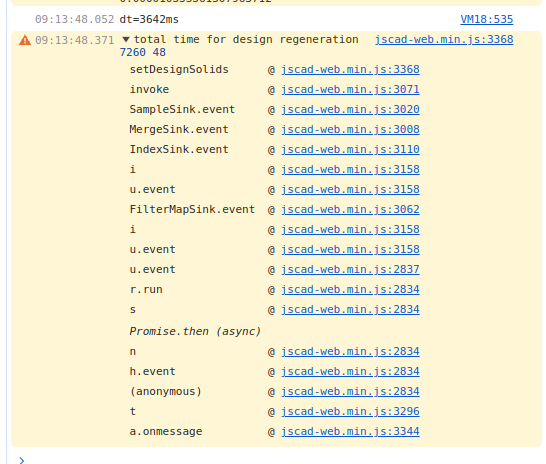
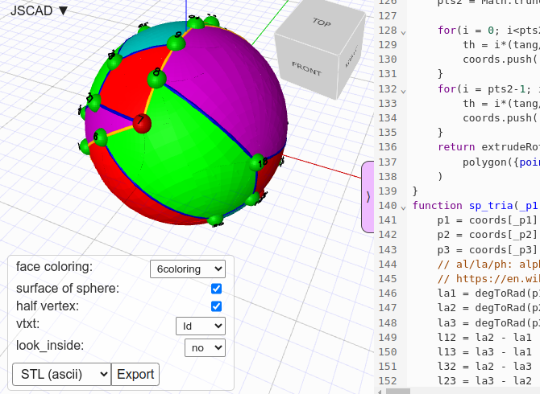

## Test setup

All tests are done with chromium browser.  
All times reported in milliseconds.  

On Raspberry 64bit PiOS (Bookworm) for Pi5.  
On Ubuntu 22.04 for miniPC.  

Pi5 booted with force_turbo=1 for running always at maximal frequency (2.4GHz if not overclocked).  
Intel Celeron j4125 runing at 2.7GHz.  

dt time measurement in model available by commit [Hermann-SW/GP3D@203b37b](https://github.com/Hermann-SW/GP3D/commit/203b37b06d0f2c6f17eeaa49820a24d674b35f7b).

## Tests

Tesing with jscad.app:  
[https://jscad.app/#https://gist.githubusercontent.com/Hermann-SW/b3e85c8fe6827cd29238c14f9da346be/raw/c840f587dd5d50ae570edc61c440a76eb8c16d70/C36.10.fixed.jscad.good_enough.jscad](https://jscad.app/#https://gist.githubusercontent.com/Hermann-SW/b3e85c8fe6827cd29238c14f9da346be/raw/c840f587dd5d50ae570edc61c440a76eb8c16d70/C36.10.fixed.jscad.good_enough.jscad)  
 
face coloring|Pi5 |Pi5 3GHz|Celeron
-|-------|-------|-------
none|2345|1992|2379
Pentagons|4852|3737|4836
6oloring|6300|5105|6539

Tesing with openjscad.xyz:  
[https://openjscad.xyz/?uri=https://gist.githubusercontent.com/Hermann-SW/b3e85c8fe6827cd29238c14f9da346be/raw/c840f587dd5d50ae570edc61c440a76eb8c16d70/C36.10.fixed.jscad.good_enough.jscad](https://openjscad.xyz/?uri=https://gist.githubusercontent.com/Hermann-SW/b3e85c8fe6827cd29238c14f9da346be/raw/c840f587dd5d50ae570edc61c440a76eb8c16d70/C36.10.fixed.jscad.good_enough.jscad)

face coloring|Pi5 |Pi5 3GHz|Celeron
-|-------|-------|-------
none|1945|1770|1873
Pentagons|3642|3008|3226
6oloring|4441|4058|4552

Wait, dt times are less than with jscad.app, but total time is longer; how can that be?  
openjscad.xyz reports "total time for design regeneration" in addition, which explains it.  
For jscad.app the display gets updated immediately after "dt=...ms" is logged in browser console.  

face coloring|Pi5 |Pi5 3GHz|Celeron
-|-------|-------|-------
none|5648|4621|7467
Pentagons|7260|4948|9835
6oloring|6816|6480|7801

The additional time seems to be spent here:  

## Summary

Left jscad.app, right openjscad.xyz total time (in milliseconds, details above).  
Prefer jscad.app over openjscad.xyz, Pi5 over miniPC, and get >20% boost by overclocking Pi5 with 3GHz.

Pi5 |Pi5 3GHz|Celeron|face coloring|Pi5 |Pi5 3GHz|Celeron
----|---|-------|-------|-|-|-
2345|1992|2379|none|5648|4621|7467
4852|3737|4836|Pentagons|7260|4948|9835
6300|5105|6539|6coloring|6816|6480|7801

C36 fullerene face coloring with 6 colors in jscad.app:  

